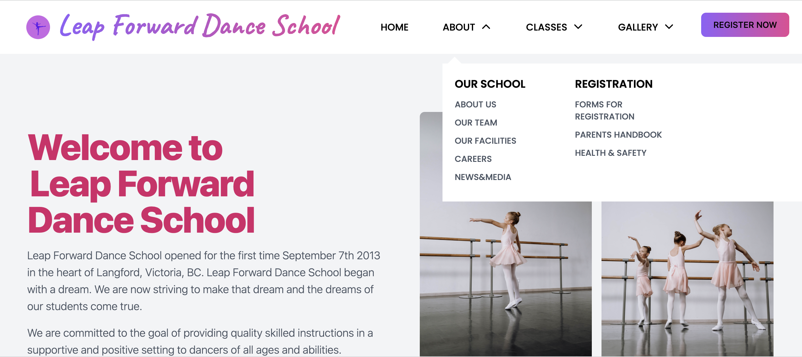

<h1 align="center">
  💻 Portfolio - Zimarlen Silva
</h1>

<h4 align="center"><a href="https://leapforwarddanceschool.netlify.app/">View project here</a></h4>

# Responsive Portfolio

- Landing page for a dance school.
- Built using React, Javascript and, Tailwind.
- Compatible with all mobile devices and with a beautiful and pleasant user interface.

## Deployment 📦

Once you finish your setup. You need to put your website online!

I highly recommend to use [Netlify](https://netlify.com) because it is super easy.

## Technologies used 🛠️

- [React](https://reactjs.org/) 
- [Javascript](https://www.javascript.com/) - JAVASCRIPT
- [Tailwind](https://tailwindui.com/) - Tailwind

## Authors

- **Zimarlen Silva** - [https://github.com/cobidev](https://github.com/ZihSilva/)